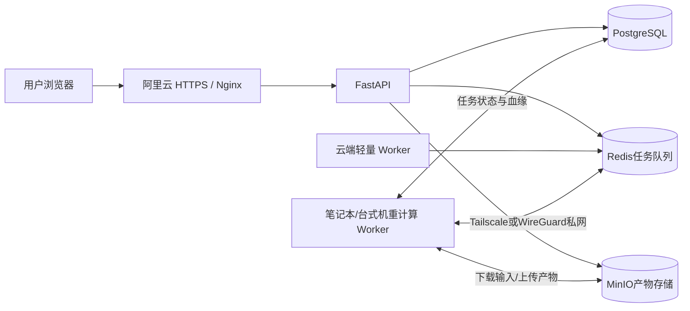

# QuantForge 混合计算 Worker 改造工作项

> 目标：阿里云继续承担公网入口、API、数据库、任务队列和对象存储；本地电脑承担因子快照、因子研究、数据集、模型训练和大型回测。先在当前笔记本验证，后续能够低成本切换到台式机或其他计算节点。

## 1. 目标架构



设计原则：

- 阿里云是控制平面和唯一数据中心，不只是流量转发器。
- 本地计算机是可替换、无状态的计算节点。
- PostgreSQL、Redis、MinIO 不直接暴露到公网。
- 同一任务只能由一个 Worker 获得执行权。
- 计算中断不能留下状态为 READY 的半成品。
- 笔记本关闭时，网站和历史资产仍能正常访问，新计算任务保持排队。
- 更换计算机时不迁移数据库，只部署同版本 Worker。

---

## 2. 当前资源基线

| 项目 | 阿里云 | 当前笔记本 |
|---|---:|---:|
| CPU | 2 核 | AMD Ryzen 7 H 255，8 核 16 线程 |
| 总内存 | 1.6 GiB | 约 21.8 GiB |
| 当前可用内存 | 约 567 MiB | 约 5.3 GiB |
| 可用磁盘 | 约 25 GB | 约 769 GB |
| Worker 内存限制 | 1 GiB | 尚未配置 |

结论：阿里云现有配置不适合全量 87 因子宽表；笔记本硬件可以作为首个计算节点，但正式运行前需要释放内存，并为 Docker/WSL2 设置合理资源上限。

---

## 3. 第一阶段：任务队列与 Worker 解耦

### 3.1 拆分轻量队列与重计算队列

- [ ] 将当前单一 `quant-backtests` 队列拆分为至少两个队列。
- [ ] `quant-light` 由云端 Worker 消费。
- [ ] `quant-heavy` 由本地计算 Worker 消费。
- [ ] 根据任务类型明确路由，不能由任意 Worker 随机抢任务。

建议路由：

| 任务类型 | 队列 | 默认执行位置 |
|---|---|---|
| 因子快照 `feature_materialize` | `quant-heavy` | 本地计算机 |
| 因子研究 `factor_research` | `quant-heavy` | 本地计算机 |
| 研究数据集 `dataset` | `quant-heavy` | 本地计算机 |
| 模型训练 `training` | `quant-heavy` | 本地计算机 |
| 最终封存评估 `sealed_evaluation` | `quant-heavy` | 本地计算机 |
| 大型组合回测 `backtest` | `quant-heavy` | 本地计算机 |
| 轻量监控、调度、通知 | `quant-light` | 阿里云 |

### 3.2 Worker 身份和能力登记

- [ ] 为每个 Worker 配置稳定名称，例如 `laptop-worker-01`、`desktop-worker-01`。
- [ ] 记录 Worker 主机、版本、启动时间、最后心跳和当前任务。
- [ ] 记录 CPU、可用内存和允许并发数。
- [ ] 任务记录实际执行 Worker，便于排查同一结果由哪台机器产生。
- [ ] 页面增加“计算节点在线/离线、空闲/运行中”状态。

### 3.3 防止重复执行

- [ ] Worker 领取任务时建立数据库租约。
- [ ] 运行期间定期续租并写入心跳。
- [ ] Worker 失联超过阈值后，将任务标记为可恢复或失败。
- [ ] 对相同资产 ID 的上传和数据库提交保持幂等。
- [ ] 最终状态提交采用事务，避免数据库 READY 但对象存储没有文件。

### 3.4 超时与取消

- [ ] 将一小时固定超时改成按任务类型配置。
- [ ] 因子快照和模型训练建议允许 4～8 小时上限。
- [ ] Worker 在计算批次之间检查 `cancel_requested`。
- [ ] 前端取消后应停止后续批次、清理临时文件并保留取消原因。
- [ ] 区分“用户取消”“资源不足”“网络失败”“程序异常”。

验收标准：云端 Worker 和本地 Worker 同时在线时，重计算任务只能进入本地节点，轻量任务不受影响。

---

## 4. 第二阶段：因子宽表低内存优化

这部分是必须完成的。更换成 22 GB 内存的电脑只能缓解问题，不能替代算法和数据管线优化。

### 4.1 分块计算

- [ ] 不再一次性把 87 个完整因子 Series 全部保存在 `computed_columns`。
- [ ] 按股票分块或按日期分区计算。
- [ ] 每个分块完成后立即写入临时 Parquet 分区。
- [ ] 合并时使用列式数据集，不重新构造全部数据的第二份宽表。
- [ ] 批大小可以通过环境变量配置。

推荐优先按股票分组计算，因为大多数滚动因子天然按股票时间序列计算；输出再按日期和股票排序。

### 4.2 降低临时内存

- [ ] 因子结果统一使用 `float32`，只有确需精度的字段保留 `float64`。
- [ ] `symbol` 使用分类编码或 Arrow dictionary encoding。
- [ ] 避免 `DataFrame.copy()`、宽表反复 merge 和不必要的索引复制。
- [ ] 计算完成一个因子或分区后主动释放中间对象。
- [ ] Parquet 直接写文件或分区，不使用整份内存 `BytesIO`。
- [ ] MinIO 上传使用文件流或分片上传。

### 4.3 复用公共滚动结果

- [ ] 建立因子依赖图，复用日收益率、20/60/120 日滚动窗口等公共结果。
- [ ] 相同窗口的均值、标准差、成交额等基础序列只计算一次。
- [ ] 表达式因子限制依赖范围，避免重复生成整份临时表。
- [ ] 对单因子记录耗时和峰值内存，定位异常定义。

### 4.4 检查点与断点恢复

- [ ] 每完成一个股票批次或日期分区写入检查点。
- [ ] 检查点绑定数据版本哈希、因子定义哈希和代码版本。
- [ ] 重启后只恢复完全匹配的检查点。
- [ ] 上传最终产物前校验所有预期分区齐全。
- [ ] 成功提交后再清理本地临时分区。

### 4.5 内容一致性

- [ ] 分块版与现有全量版在 12 因子小样本上逐列比较。
- [ ] 明确 NaN、无穷值、窗口起始期和排序规则。
- [ ] 固定 Parquet 行顺序、列顺序和压缩参数。
- [ ] 确保同输入和同代码版本能够得到一致的内容哈希，或明确记录允许的浮点误差。

验收标准：382,614 行、87 因子任务的峰值内存不超过设定预算，过程中可以取消，网络中断或 Worker 重启后可以安全恢复或明确失败。

---

## 5. 第三阶段：本地输入缓存与网络优化

- [ ] 按标准化数据内容哈希建立本地只读缓存。
- [ ] 同一数据版本重复研究时不重新从 MinIO 下载。
- [ ] 下载完成后先验证 SHA-256，再进入计算。
- [ ] 因子快照上传完成后由云端重新校验哈希。
- [ ] 设置缓存空间上限和 LRU 清理规则。
- [ ] 临时文件、输入缓存、成功产物使用不同目录。
- [ ] 网络失败采用有限次数指数退避，不能无限重试。
- [ ] 显示下载、计算、合并、上传四个阶段的独立进度。

建议本地目录：

```text
quantforge-worker-data/
├── cache/          # 以数据哈希命名的只读输入
├── checkpoints/    # 可恢复的任务分区
├── staging/        # 尚未提交的最终产物
└── logs/           # 本地运行日志
```

验收标准：第二次使用同一标准化数据时命中本地缓存；上传失败不会导致重新计算全部因子。

---

## 6. 第四阶段：云端私网和安全配置

### 6.1 建立加密私网

- [ ] 在阿里云和笔记本安装 Tailscale 或配置 WireGuard。
- [ ] 为两台机器分配稳定私网地址。
- [ ] 使用 ACL 只允许计算节点访问必要服务。
- [ ] 禁止计算节点通过私网访问无关的管理端口。
- [ ] 配置节点密钥轮换和设备注销流程。

### 6.2 服务只通过私网暴露

- [ ] PostgreSQL、Redis、MinIO 不开放公网安全组。
- [ ] 仅监听本机、Docker 网络或隧道地址。
- [ ] 防火墙限制来源为计算节点私网身份/IP。
- [ ] 公网仍然只保留 80/443 和必要的受控 SSH。

### 6.3 最小权限凭据

- [ ] 创建专用 PostgreSQL Worker 用户，不使用管理员账户。
- [ ] 创建 Redis ACL 用户，只允许指定队列和必要操作。
- [ ] 创建专用 MinIO Access Key，只允许 `quant-artifacts` 所需路径。
- [ ] 凭据写入本地安全配置，不提交到 Git。
- [ ] 制定笔记本丢失后的密钥撤销流程。

验收标准：从公网无法直接连接 5432、6379、9000；只有已授权计算节点能够通过私网访问。

---

## 7. 第五阶段：笔记本 Worker 部署

### 7.1 运行环境

- [ ] 安装并更新 Docker Desktop/WSL2。
- [ ] 使用与云端完全一致的 Worker 镜像版本。
- [ ] 固定 Python、Pandas、PyArrow、scikit-learn 等依赖版本。
- [ ] 为 Worker 建立独立 Compose 文件或 `compute-worker` profile。
- [ ] 只启动 Worker，不在笔记本重复启动 PostgreSQL、Redis 和 MinIO。

### 7.2 资源配置

- [ ] Docker/WSL2 内存上限先设置为 14～16 GB。
- [ ] Worker 并发固定为 1。
- [ ] CPU 初始分配 6～8 个逻辑核心，测试期间观察温度和系统响应。
- [ ] 保持系统分页文件可用，但不能把交换分区当作正常内存方案。
- [ ] 临时目录放在剩余空间充足的 SSD。
- [ ] 运行大型任务前保证宿主机至少有约 12～14 GB 可用内存。

当前笔记本只有约 5.3 GB 可用内存，因此正式测试前需要关闭大型浏览器会话、开发工具或其他高内存程序。

### 7.3 稳定运行

- [ ] 接通电源时禁止自动睡眠和休眠。
- [ ] Docker、私网客户端和 Worker 支持开机自启。
- [ ] Worker 崩溃后自动重启，但对同一失败任务限制重试次数。
- [ ] 日志按大小轮转，避免长期占满磁盘。
- [ ] 监控 CPU、内存、磁盘、温度、网络和任务心跳。
- [ ] 页面显示“本地计算节点离线，任务正在等待”，避免误报应用挂掉。

验收标准：笔记本重启后可以自动重新加入私网和任务队列，不需要手动打开开发终端。

---

## 8. 第六阶段：分级验证

### 8.1 功能验证顺序

- [ ] 使用小数据和 1～3 个因子验证端到端连接。
- [ ] 重新计算已有 12 因子快照，与历史结果逐列对比。
- [ ] 重新计算已有 36 因子快照，比较哈希、缺失率和统计分布。
- [ ] 运行 87 因子快照并记录各阶段时间和资源峰值。
- [ ] 基于 87 因子快照运行一次因子研究。
- [ ] 构建研究数据集并训练一个逻辑回归基准模型。
- [ ] 完成一次调参区组合回测。

### 8.2 故障演练

- [ ] 计算中途断开网络，确认任务不会生成错误 READY 资产。
- [ ] 计算中途重启 Worker，验证检查点恢复或明确失败。
- [ ] 上传中途断网，确认可以只重试上传。
- [ ] 点击取消，确认计算及时终止并清理临时文件。
- [ ] 笔记本关机后提交新任务，确认任务保持排队且云端网站正常。
- [ ] 恢复笔记本后，确认排队任务能够继续执行。

### 8.3 建议验收指标

| 指标 | 建议目标 |
|---|---|
| 87 因子任务峰值内存 | 不超过 Worker 内存预算的 80% |
| Worker 并发 | 1 |
| 任务状态心跳 | 30～60 秒更新一次 |
| 节点失联识别 | 2～5 分钟 |
| 输入缓存命中 | 同数据版本重复任务不重新下载 |
| 产物完整性 | 云端 SHA-256 校验通过后才标记 READY |
| 断点恢复 | 已完成分区不重复计算 |

---

## 9. 从笔记本切换到台式机

### 9.1 难度结论

只要前面的“无状态 Worker、统一镜像、外置配置、私网访问、检查点”完成，切换到台式机属于低难度运维操作，不需要修改业务代码，也不需要迁移 PostgreSQL、Redis 或 MinIO。

需要迁移的只有：

- Worker 容器镜像或对应 Git 版本；
- 不包含在 Git 中的环境配置；
- 私网设备身份；
- 可选的本地输入缓存和未完成检查点。

### 9.2 标准切换步骤

1. 等待笔记本当前任务完成，或安全取消并确认检查点已落盘。
2. 将笔记本 Worker 标记为 `draining`，不再领取新任务。
3. 在台式机安装 Docker/WSL2 和私网客户端。
4. 拉取与笔记本相同版本的 Worker 镜像。
5. 注入台式机专用数据库、Redis 和 MinIO 凭据。
6. 使用新名称 `desktop-worker-01` 启动 Worker。
7. 完成 1 因子和 12 因子冒烟测试。
8. 确认台式机开始消费 `quant-heavy` 后停止笔记本 Worker。
9. 撤销笔记本凭据，或把笔记本保留为关闭状态的备用节点。

### 9.3 是否需要复制缓存

不强制。台式机可以根据内容哈希重新从云端下载输入。复制缓存只能减少第一次下载时间，不能成为迁移前提。

如果需要迁移未完成任务的检查点，必须同时满足：

- 输入数据哈希一致；
- 因子定义哈希一致；
- Worker 镜像/代码版本一致；
- 检查点格式版本一致。

不满足时应重新计算，不能强行续跑。

### 9.4 后续扩展为多 Worker

未来可以让笔记本和台式机同时在线，但建议：

- 每台机器并发仍从 1 开始；
- 一个任务只在一台机器运行，不拆成跨主机共享内存计算；
- 不同任务可以并行分配到不同机器；
- 对高内存任务声明资源要求，只派给满足条件的节点；
- 节点之间不直接同步最终产物，统一上传到云端 MinIO。

---

## 10. 上线与回滚

### 10.1 上线顺序

- [ ] 先发布队列路由、任务租约和兼容旧 Worker 的代码。
- [ ] 保持云端旧 Worker 可回滚，但暂不领取重任务。
- [ ] 接入笔记本 Worker，只运行小任务。
- [ ] 完成 12、36、87 因子分级验证。
- [ ] 观察一段稳定运行期后再把所有重任务默认路由到本地。

### 10.2 回滚方案

- [ ] 本地 Worker 异常时暂停 `quant-heavy` 消费，不影响前端/API。
- [ ] 未开始任务继续排队。
- [ ] 已中断任务依据检查点恢复，或明确标记失败后重新提交。
- [ ] 必要时临时扩容云服务器并恢复云端重 Worker。
- [ ] 不回滚数据库资产历史，不删除已成功产物。

---

## 11. 建议实施批次

### 批次 A：先跑起来

- 私网连通；
- 笔记本 Worker 容器；
- 云端暂停重计算 Worker；
- 并发 1；
- 小任务、12 因子和 36 因子验证。

这一步可以较快证明远程 Worker 架构可用，但还不适合长期无人值守运行 87 因子。

### 批次 B：解决 87 因子稳定性

- 因子分块；
- Parquet 分区写入；
- 流式上传；
- 检查点和取消；
- 内存与进度监控；
- 87 因子完整验证。

### 批次 C：生产化

- 轻重队列拆分；
- Worker 心跳与页面状态；
- 最小权限凭据；
- 自动启动、告警、日志轮转；
- 台式机切换演练；
- 故障恢复和回滚演练。

---

## 12. 最终完成定义

满足以下条件才算改造完成：

- [ ] 云端在本地计算机离线时仍可正常提供网站和历史报告。
- [ ] 重计算任务不会再被 1 GiB 的云端 Worker 抢走。
- [ ] 87 因子快照在本地节点完整成功至少两次。
- [ ] 两次结果的数据质量和内容哈希符合可复现要求。
- [ ] 任务可以取消、失败、恢复，不产生伪 READY 资产。
- [ ] 数据库、Redis、MinIO 没有暴露到公网。
- [ ] 笔记本重启后 Worker 能自动恢复服务。
- [ ] 已完成一次从笔记本到另一台计算节点的切换演练。
- [ ] 切换计算节点不需要修改业务代码或迁移云端数据。

## 13. 总体判断

本方案包含两项同等重要的工作：

1. **本地代码和数据管线优化**：解决全量宽表、内存副本、上传失败和不可恢复问题。
2. **分布式 Worker 部署调整**：解决计算资源放在哪里、任务如何安全领取以及本地节点离线的问题。

只做第二项，可以让 87 因子暂时借助更大内存运行，但仍可能遇到峰值内存、超时和中断后重算；只做第一项，云端 1 GiB Worker 仍然过于紧张。两部分应配套完成。

完成容器化和无状态改造后，从当前笔记本切换到台式机并不困难。正常情况下，台式机准备和切换属于部署工作，而不是再次开发一套系统。

---

## 14. 2026-08-25 实施状态

已完成并通过测试：

- 轻重队列路由以及默认 `legacy` 回滚模式；
- Worker 名称、任务队列、心跳和租约字段；
- 重任务 8 小时、轻任务 1 小时的分类超时；
- 按股票分区的低内存因子快照、原子 Parquet 写入和 SHA-256 校验；
- 输入缓存、分区检查点、断点复用和对象存储有限重试；
- 独立计算 Worker Compose、16 GB/8 CPU 上限和并发 1；
- VPN 与 SSH 两种传输模式；SSH 模式支持热点网络且不公开数据库端口；
- 38.26 万行、200 股票、87 因子合成压力测试：峰值 RSS 约 298 MiB；
- 本机真实数据端到端烟测，以及 5/5 分区零重算恢复；
- 后端 86 项测试全部通过。

上线仍需依照部署手册完成：

- 云端兼容发布、数据库备份和回滚锚点；
- 云端回环网关和笔记本 SSH 隧道连接；
- 云端切换 `split` 路由后执行真实 12/36/87 因子分级验证；
- 故障演练、长期运行观察，以及专用最小权限凭据；
- 稳定后将相同镜像和外置配置移植到台式机。
